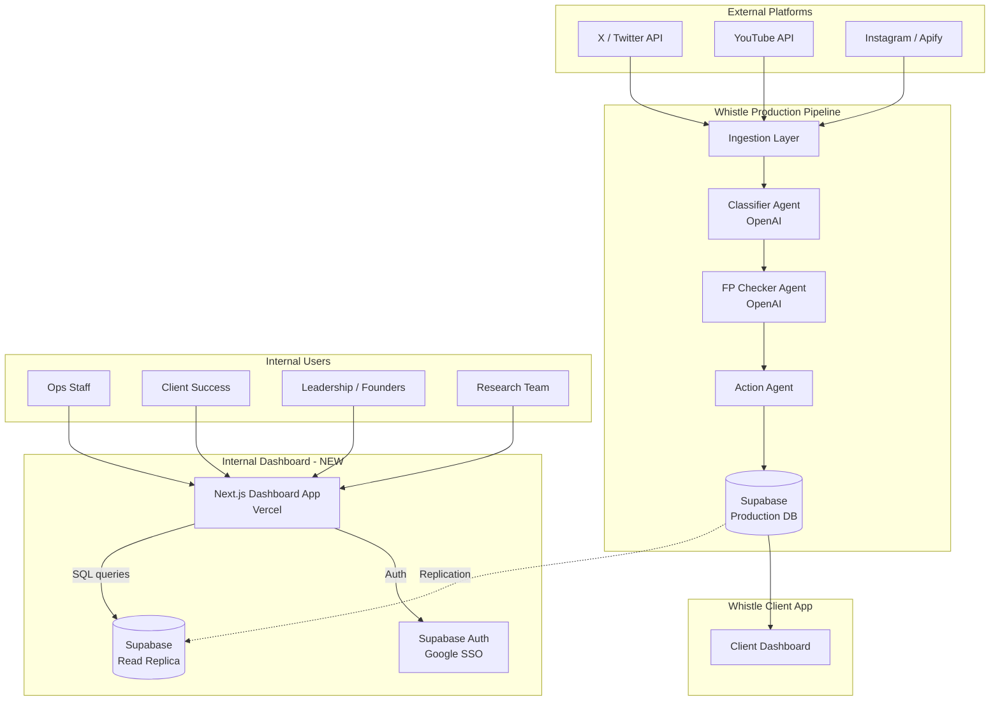
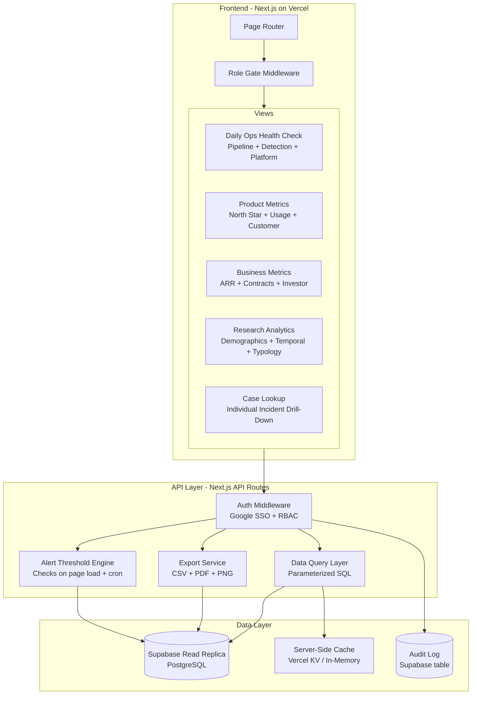
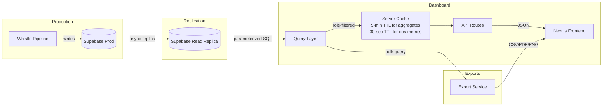
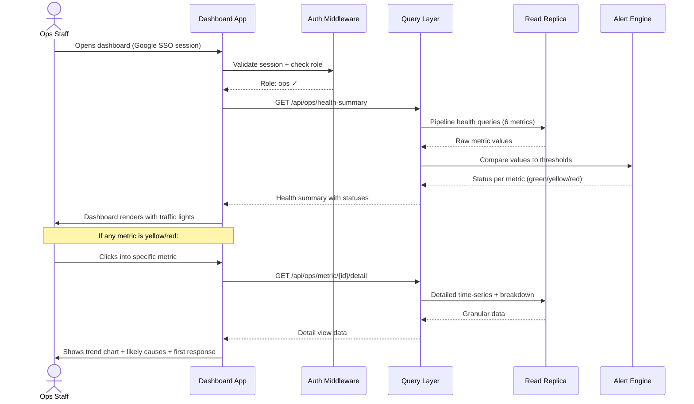
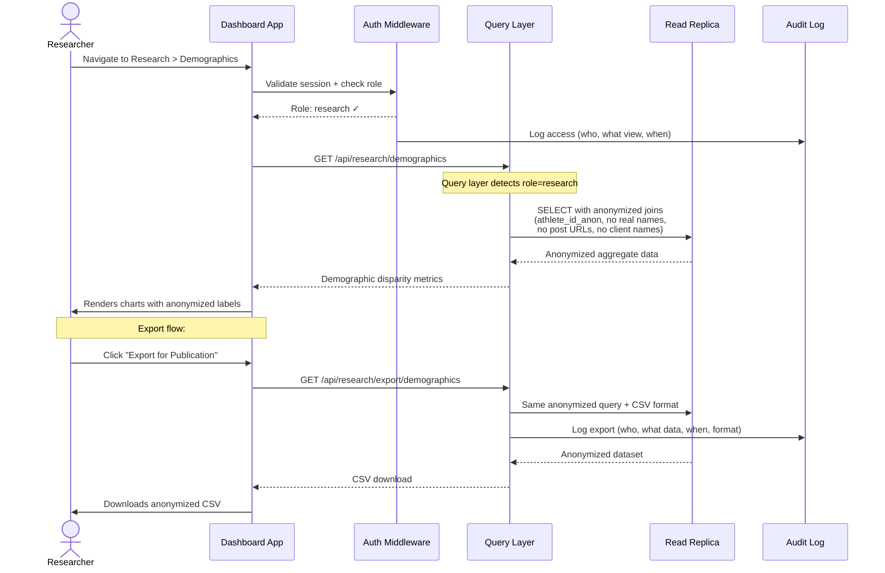
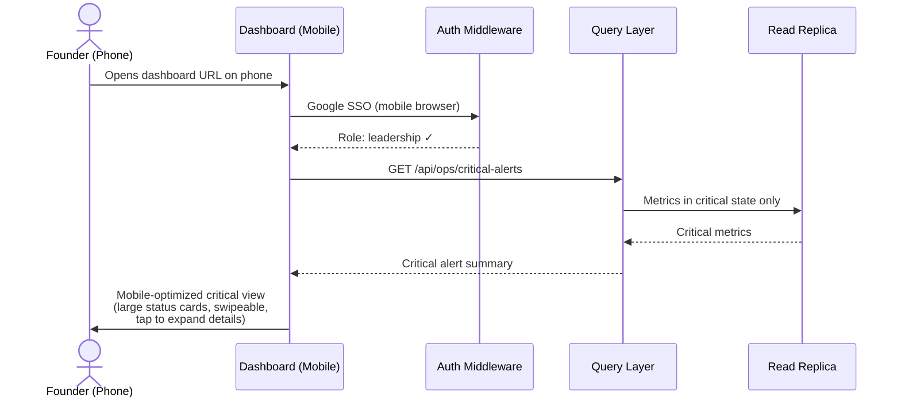

# Whistle Internal Dashboard — System Architecture Plan

**Author:** Technical Architect | **Date:** 2026-03-20 | **Status:** Draft — Pending CISO & CPO Review

---

## Key Decisions Summary

| Decision | Choice | Rationale |
|---|---|---|
| Application type | Single Next.js app with role-based views | One codebase, simpler ops, role gates control visibility |
| Data source | Supabase read replica | Isolates dashboard load from production pipeline (CISO-recommended) |
| Authentication | Google SSO via Supabase Auth | Team uses Google Workspace; no passwords to manage |
| Authorization | Role-based access control (4 roles) | Matches org structure: ops, client success, leadership, research |
| Hosting | Vercel (Next.js) + Supabase (data) | Team already uses Supabase; Vercel is zero-ops for Next.js |
| Responsive strategy | Desktop-first, mobile-usable | Primary use is desktop morning checks; phone for emergency triage |

---

## Problem Statement

NetRef Safety operates the Whistle product — a real-time pipeline that ingests social media posts targeting athletes, classifies them across 13 harm categories, filters false positives, and triggers alerts for client organizations. The pipeline currently writes to Supabase as its production database.

**The problem:** The team has no unified way to monitor whether this pipeline is healthy, whether clients are getting value, whether detection quality is holding, or what aggregate patterns look like across the athlete abuse dataset. Three separate specification documents define ~50 metrics across daily operations, product/business health, and research analytics. Today, checking any of this requires raw database queries.

**What we need:** A single internal dashboard — separate from the client-facing Whistle app — that gives non-technical employees a clear, role-appropriate view of system health, client health, detection quality, business metrics, and research-grade analytics. It must be simple enough for a non-engineer to use in a 15-minute morning check, and detailed enough for a researcher to drill into incident-level patterns.

**Hard constraints:**
- Must read from existing Supabase data (no new data infrastructure for v1)
- Must be separate from the client-facing Whistle app
- Must support Google SSO for the internal team
- Must handle sensitive athlete demographic data with strict access controls
- Desktop primary, phone accessible for emergencies
- Small team (startup — likely 2-10 internal users initially)

---

## System Context

Where the dashboard sits relative to existing systems:



**Key boundary:** The internal dashboard is read-only against a replica of the production database. It never writes to production. It never touches the pipeline. It is a consumer of data, not a participant in the pipeline.

---

## High-Level Architecture



### Component Responsibilities

| Component | Responsibility |
|---|---|
| **Page Router** | Serves the 5 main views + sub-views; handles URL-based navigation |
| **Role Gate Middleware** | Checks user role on every request; blocks unauthorized view access |
| **Daily Ops Health Check** | Renders Section 1-5 from the daily health check spec with traffic-light status indicators |
| **Product Metrics** | Renders north star metric, usage metrics, customer health from the metrics brief |
| **Business Metrics** | Renders ARR/MRR, contracts, NPS, investor narrative metrics |
| **Research Analytics** | Renders demographic disparity analysis, temporal patterns, abuse typology |
| **Case Lookup** | Allows searching for individual incidents by athlete, client, date range, harm category |
| **Auth Middleware** | Validates Google SSO tokens, maps users to roles, enforces RBAC |
| **Data Query Layer** | All database queries are parameterized and go through this layer; no raw SQL from the frontend |
| **Export Service** | Generates CSV, PDF, and PNG exports for investor snapshots and research outputs |
| **Alert Threshold Engine** | Compares current metric values against thresholds defined in the health check spec |
| **Audit Log** | Records who accessed what data and when — critical for research data governance |

---

## Role-Based Access Control

| Role | Ops Health | Detection Quality | Platform Status | Cost & Economics | Client Health | Business Metrics | Research Analytics | Case Lookup | Exports |
|---|---|---|---|---|---|---|---|---|---|
| **ops** | ✅ Full | ✅ Full | ✅ Full | ⚠️ View only | ❌ | ❌ | ❌ | ✅ Technical only | ❌ |
| **client_success** | ⚠️ Summary | ✅ Full | ⚠️ Summary | ❌ | ✅ Full | ❌ | ❌ | ✅ Client-scoped | ✅ Client reports |
| **leadership** | ✅ Full | ✅ Full | ✅ Full | ✅ Full | ✅ Full | ✅ Full | ✅ Full | ✅ Full | ✅ All |
| **research** | ❌ | ✅ Aggregated | ❌ | ❌ | ❌ | ❌ | ✅ Full (anonymized) | ✅ Anonymized only | ✅ Research exports |

**Critical privacy constraint:** The research role sees only anonymized data. Athlete real names, client names, and post URLs are stripped at the query layer — not the UI layer. The query layer returns anonymized IDs by default for the research role.

---

## Data Architecture

### Source of Truth

All data originates in the Supabase production database, written by the Whistle pipeline. The internal dashboard reads from a **Supabase read replica** that replicates asynchronously (typically <1 second lag). This means:

- Dashboard data may be up to a few seconds behind real-time — acceptable for a monitoring dashboard
- The dashboard cannot accidentally corrupt production data
- Heavy dashboard queries (research analytics, exports) don't slow down the pipeline

### Key Tables the Dashboard Reads

| Table | Primary Use | Dashboard Sections |
|---|---|---|
| `incidents` | Every flagged post with harm scores, timestamps, classifications | Ops 2.x, Metrics 1.x, Research all |
| `pipeline_jobs` | Job execution logs per stage (ingestion, classifier, FP checker, action) | Ops 1.x |
| `platform_status` | Per-platform ingestion health, API credential status | Ops 3.x |
| `athletes` | Athlete profiles (anonymized for research) | Research 3.x, Case lookup |
| `clients` | Client organizations, plans, onboarding dates | Metrics 2.x, Business 3.x |
| `client_admin_sessions` | Admin login/activity tracking | Metrics 2.2, Ops 5.x |
| `alert_actions` | Client admin actions on alerts (acknowledge, dismiss, escalate) | Metrics 1.5, Ops 5.2 |
| `api_costs` | Daily LLM API spend records | Ops 4.x, Metrics 5.3 |
| `trigger_events` | Logged events linked to athletes (games, announcements) | Research 2.x |
| `campaigns` | Coordinated abuse campaign records | Research 4.2 |
| `monthly_aggregates` | Pre-computed monthly rollups for research | Research 5.x |

### Data Flow for Dashboard Queries



### Caching Strategy

Not every metric needs to hit the database on every page load. The caching strategy is:

| Metric Type | Cache TTL | Rationale |
|---|---|---|
| Pipeline health (ops) | 30 seconds | Needs near-real-time during incidents |
| Detection quality | 5 minutes | Aggregates over 24h/7d; small delay acceptable |
| Client health | 15 minutes | Login data doesn't change by the second |
| Business metrics | 1 hour | ARR/MRR changes slowly |
| Research aggregates | 1 hour | Pre-computed monthly data; rarely changes |
| Investor snapshot | 1 hour | Computed from already-cached data |

---

## Key Interactions

### 1. Morning Health Check Flow (Happy Path)



### 2. Research Data Access with Anonymization



### 3. Emergency Mobile Access



---

## Technology Recommendations

### 1. Frontend Framework: Next.js 14+ (App Router)

**Recommendation:** Next.js with server-side rendering for data-heavy views.

**Reasoning:** The dashboard is read-heavy with complex data fetching. Server components let us query Supabase from the server (no exposed API keys in the browser), render charts server-side for faster initial load, and still use client components for interactive filters and drill-downs. The team is building a startup — Next.js on Vercel is effectively zero-ops hosting with automatic preview deployments for code review.

**Alternatives considered:**
- *Remix* — Similar benefits, smaller ecosystem for charting/dashboard libraries.
- *Plain React SPA + Express* — More setup, need to self-host or configure a separate API server, no SSR benefits.
- *Retool / internal tool builder* — Fast to prototype, but limited customization for the research analytics views and investor export formatting. Also introduces a vendor dependency for a core internal tool.

**Exit path:** Next.js is React under the hood. If Vercel pricing becomes an issue, the app can be self-hosted on any Node.js platform (Railway, Fly.io, AWS ECS) with minimal changes.

### 2. Data Layer: Supabase Read Replica (PostgreSQL)

**Recommendation:** Create a Supabase read replica; the dashboard queries exclusively against it.

**Reasoning:** The CISO will likely mandate separation between the pipeline's write path and the dashboard's read path. A read replica provides this isolation with near-zero lag (<1s), no schema changes required, and Supabase supports this natively on the Pro plan. The dashboard never needs to write to the pipeline database — it is purely a consumer.

**Alternatives considered:**
- *Direct Supabase connection* — Simpler, but a heavy research export query could slow down real-time incident classification. Unacceptable.
- *Separate analytics warehouse (BigQuery, Snowflake)* — Overkill for current scale (likely <100K incidents/month). Adds ETL complexity and cost. Revisit at 1M+ incidents/month.
- *Materialized views in production DB* — Helps with query performance but doesn't solve the load isolation problem.

**Exit path:** If the team outgrows Supabase, the read replica is standard PostgreSQL — it can be migrated to any managed PostgreSQL service (RDS, Cloud SQL, Neon) or to a dedicated analytics store.

### 3. Authentication: Supabase Auth with Google SSO

**Recommendation:** Supabase Auth with Google OAuth provider.

**Reasoning:** The team uses Google Workspace. Supabase Auth natively supports Google as an OAuth provider, which means Google SSO with no custom auth server needed. User roles are stored in a `user_roles` table in the dashboard's own schema (not the production DB). The auth middleware checks both: (1) valid Google SSO session and (2) user exists in the `user_roles` table with an assigned role.

**Important:** Only pre-approved Google accounts can access the dashboard. There is no self-registration. A leadership user must manually add new users to the `user_roles` table.

### 4. Charting: Recharts + Custom SVG

**Recommendation:** Recharts for standard charts (line, bar, area), custom SVG for the traffic-light health check display and heatmaps.

**Reasoning:** Recharts is React-native, well-documented, handles responsive sizing, and covers 80% of the chart types needed (time-series, bar charts, area charts, funnels). The daily ops health check view needs custom traffic-light indicators and the research heatmap (clients × harm categories) is better as custom SVG. No need for a heavy library like D3 for the MVP.

### 5. Export: Server-Side PDF/CSV Generation

**Recommendation:** `@react-pdf/renderer` for investor snapshot PDFs, `papaparse` for CSV exports.

**Reasoning:** The investor export view needs a pre-formatted one-page snapshot exportable as PDF — this is a specific requirement from the metrics brief. CSV export is needed for research data. Both are generated server-side to keep sensitive data off the client when possible.

---

## Failure Modes and Resilience

| Component | Failure Mode | Detection | Recovery |
|---|---|---|---|
| **Read replica** | Replication lag > 30s | Monitor `pg_stat_replication` lag | Dashboard shows "data may be delayed" banner; ops can check prod directly |
| **Read replica** | Replica down | Health check endpoint returns 503 | Dashboard shows cached data with "stale data" warning; alert founders |
| **Google SSO** | Google OAuth outage | Auth middleware returns 503 | Users see "auth unavailable" page; no fallback login (security requirement) |
| **Vercel hosting** | Deployment failure | Vercel status check | Previous deployment remains active (Vercel immutable deployments) |
| **Heavy query** | Research export times out | Query timeout set at 30s | Return partial results with warning; suggest narrower date range |
| **Cache** | Cache invalidation failure | Stale data detected by version check | Clear cache on demand; worst case is slightly stale dashboard data |

**Key resilience principle:** This is a read-only dashboard. The worst failure mode is "the dashboard is temporarily unavailable or shows slightly stale data." The Whistle pipeline itself is unaffected by any dashboard failure. This is by design.

---

## Scaling Strategy

**Current scale estimate:** 5-10 internal users, <100 concurrent sessions, <100K incidents/month in the database.

**Where bottlenecks will appear first:**
1. **Research aggregate queries** — queries spanning months of incident data with demographic joins will be the first to slow down. Mitigation: pre-compute monthly aggregates (the research spec already defines this) and query those instead of raw incidents.
2. **Export generation** — large CSV exports of anonymized incident data. Mitigation: server-side streaming with chunked responses; add a "your export is generating" UI state.
3. **Chart rendering** — if a single view tries to render 20 charts at once. Mitigation: lazy-load charts below the fold; use server components for initial render.

**What 10x looks like:** 50-100 users, 1M incidents/month. At this scale, consider: dedicated analytics database (ClickHouse or TimescaleDB), background job queue for exports, and CDN-cached snapshot images for the investor view.

---

## Application Structure

```
whistle-internal-dashboard/
├── src/
│   ├── app/                          # Next.js App Router
│   │   ├── layout.tsx                # Root layout with auth check
│   │   ├── page.tsx                  # Home → redirects to role-appropriate default view
│   │   ├── login/                    # Google SSO login page
│   │   ├── ops/                      # Daily Ops Health Check views
│   │   │   ├── page.tsx              # Summary dashboard (traffic lights)
│   │   │   ├── pipeline/             # Pipeline health detail
│   │   │   ├── detection/            # Detection quality detail
│   │   │   ├── platforms/            # Platform connectivity detail
│   │   │   ├── costs/                # Cost & economics detail
│   │   │   └── clients/              # Client activity detail
│   │   ├── metrics/                  # Product & Business Metrics
│   │   │   ├── page.tsx              # North star + key metrics
│   │   │   ├── usage/                # Product usage metrics
│   │   │   ├── customers/            # Customer health
│   │   │   ├── business/             # ARR, contracts, NPS
│   │   │   └── investor/             # Investor snapshot (exportable)
│   │   ├── research/                 # Research Analytics
│   │   │   ├── page.tsx              # Research overview
│   │   │   ├── demographics/         # Target demographics & disparity
│   │   │   ├── temporal/             # Temporal patterns & triggers
│   │   │   ├── typology/             # Abuse typology & categories
│   │   │   ├── campaigns/            # Coordinated campaign analysis
│   │   │   └── exports/              # Research data export
│   │   └── cases/                    # Individual Case Lookup
│   │       ├── page.tsx              # Search interface
│   │       └── [id]/                 # Incident detail view
│   ├── components/
│   │   ├── ui/                       # Base UI components (buttons, cards, badges)
│   │   ├── charts/                   # Chart components (wrappers around Recharts)
│   │   ├── health/                   # Traffic light indicators, status badges
│   │   ├── layout/                   # Sidebar nav, header, mobile nav
│   │   └── data-tables/              # Sortable, filterable data tables
│   ├── lib/
│   │   ├── supabase/                 # Supabase client + query functions
│   │   ├── auth/                     # Auth helpers + role checking
│   │   ├── thresholds/               # Threshold definitions from health check spec
│   │   └── anonymize/                # Anonymization utilities for research queries
│   └── middleware.ts                  # Auth + RBAC middleware
├── supabase/
│   └── migrations/                   # Dashboard-specific tables (user_roles, audit_log)
└── public/
    └── ...                           # Static assets
```

---

## Open Questions and Risks

| # | Question | Impact | Recommendation |
|---|---|---|---|
| 1 | Does Supabase plan support read replicas? | Architecture depends on this | Verify Supabase plan tier; if not available, use connection pooling with read-only credentials as interim |
| 2 | How are the 13 harm categories defined in the DB schema? | Affects every chart and filter | Need schema documentation from the pipeline team |
| 3 | Is athlete demographic data (race, LGBTQ status) currently in the database? | Research views depend on this | If not yet collected, research views show "data collection in progress" placeholders |
| 4 | What is the current incident volume per month? | Affects caching and query optimization strategy | Estimate from pipeline team; design for 100K/month initially |
| 5 | Does the team have a Vercel account or preference for hosting? | Deployment setup | Vercel free tier may suffice for internal use; Pro if preview deployments needed |
| 6 | Are there existing Supabase RLS policies? | Dashboard queries must respect existing row-level security | Audit existing RLS before building query layer |

---

*This document is pending review by the CISO (security architecture, data isolation, auth) and CPO (privacy impact, anonymization approach, research data governance) before implementation begins.*
