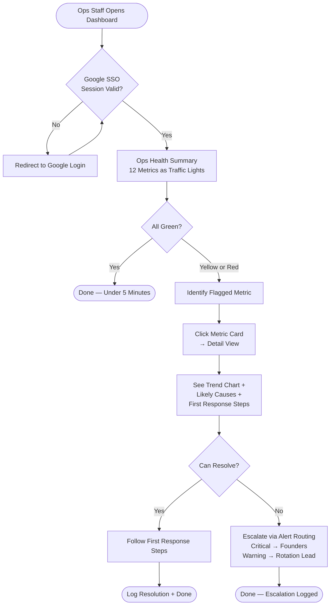
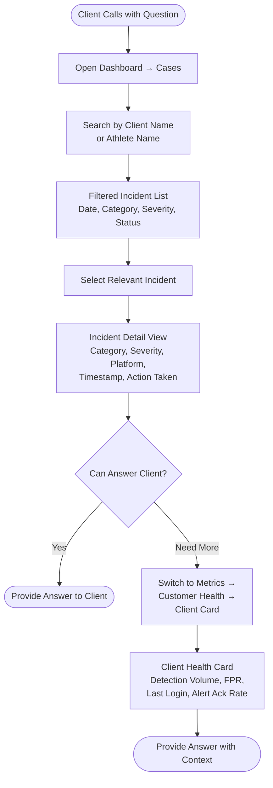
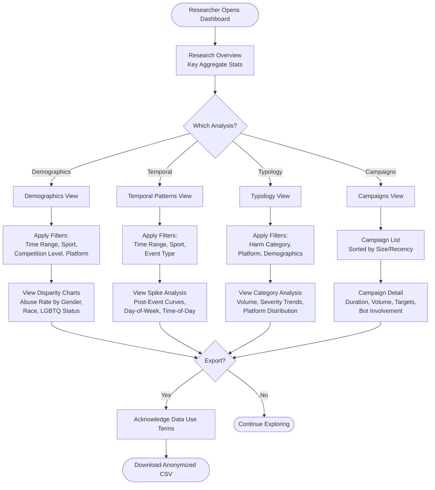

# UX Design — Whistle Internal Dashboard

**Deliverable:** Information Architecture, User Flows, and Wireframe Specifications
**Date:** 2026-03-20 | **Version:** 1.0

---

## Users & Context

Four distinct user types, all internal employees at NetRef Safety, all non-technical (except ops, who are semi-technical). The dashboard is their morning routine tool — it needs to load fast, surface problems immediately, and get out of the way when everything is fine.

| Persona | Primary Task | Frequency | Mental Model |
|---|---|---|---|
| **Ops Staff** | "Is the pipeline healthy? Is the AI working correctly?" | Daily, 8am check + on-demand during incidents | Traffic lights — green/yellow/red. Show me the status, let me drill in. |
| **Client Success** | "Are our clients happy? Are they using the product?" | Daily check + when clients call with questions | Client cards — show me each client's health at a glance. |
| **Leadership** | "Is the business on track? What do I show investors?" | Daily quick scan + weekly deep dive + investor prep | Executive summary — headlines, trends, and exportable snapshots. |
| **Research** | "What patterns exist in the abuse data?" | Weekly deep dives + publication prep | Analyst workbench — filters, breakdowns, exports. |

---

## Information Architecture

```mermaid
graph TD
    Login[Login<br/>Google SSO] --> Home[Home<br/>Role-Appropriate Landing]

    Home --> Ops[Operations]
    Home --> Metrics[Metrics]
    Home --> Research[Research]
    Home --> Cases[Case Lookup]

    subgraph "Operations Hub"
        Ops --> OpsSum[Health Summary<br/>Traffic Light Grid]
        OpsSum --> Pipeline[Pipeline Health<br/>Ingestion, Classifier, FP, Action]
        OpsSum --> Detection[Detection Quality<br/>Rates, FPR, Confidence, Distribution]
        OpsSum --> Platforms[Platform Status<br/>X, YouTube, Instagram]
        OpsSum --> Costs[Cost Monitor<br/>API Spend, Unit Economics]
        OpsSum --> ClientAct[Client Activity<br/>Logins, Acknowledgements]
    end

    subgraph "Metrics Hub"
        Metrics --> NorthStar[North Star<br/>Incidents Detected & Actioned]
        Metrics --> Usage[Product Usage<br/>Accounts, Volume, FPR, Latency]
        Metrics --> Customers[Customer Health<br/>Per-Client Cards]
        Metrics --> Business[Business<br/>ARR, Contracts, NPS]
        Metrics --> Investor[Investor Snapshot<br/>Exportable One-Pager]
    end

    subgraph "Research Hub"
        Research --> ResOverview[Overview<br/>Key Research Metrics]
        Research --> Demographics[Demographics<br/>Disparity Analysis]
        Research --> Temporal[Temporal Patterns<br/>Triggers, Spikes, Seasons]
        Research --> Typology[Abuse Typology<br/>Categories, Severity, Language]
        Research --> Campaigns[Campaigns<br/>Coordinated Abuse Analysis]
        Research --> Exports[Data Exports<br/>CSV, Research Datasets]
    end

    subgraph "Case Lookup"
        Cases --> Search[Search<br/>By Athlete, Client, Date, Category]
        Search --> Detail[Incident Detail<br/>Role-Appropriate View]
    end
```



### Navigation Design Rationale

The top-level navigation has 4 items: Operations, Metrics, Research, Cases. This respects the 5-7 item limit and maps directly to the four mental models above. Each user type has a clear "home" section:

- Ops staff land on Operations (their morning check)
- Client Success lands on Metrics > Customer Health
- Leadership lands on the Home summary (a cross-section of all areas)
- Research lands on Research

The sidebar within each section shows the sub-pages. This keeps the top nav clean and gives each section room to breathe.

---

## Key User Flows

### Flow 1: Morning Health Check (Ops Staff)



**Design goal:** The entire happy-path flow (everything green) takes under 2 minutes. The dashboard loads with all 12 health metrics visible as a grid of traffic-light cards — no scrolling required on desktop. Each card shows: metric name, current value, status color, and a sparkline trend.

### Flow 2: Client Inquiry Response (Client Success)



**Design goal:** From "client calls" to "answer ready" in under 60 seconds. The Case Lookup search must be fast — autocomplete on client/athlete names, pre-filtered by the client_success user's assigned clients.

### Flow 3: Research Data Exploration



**Design goal:** The research view is an analyst workbench. Every chart has a persistent filter bar that stays visible as the user scrolls. Filters should be "sticky" — if the researcher sets a time range and sport on the demographics page, those filters carry over when they switch to temporal patterns. All data is anonymized; no athlete names appear anywhere in this section.

---

## Wireframe Specifications

### Ops Health Summary (Primary Dashboard View)

```
┌──────────────────────────────────────────────────────────────────┐
│  🟢 Whistle Operations          [Shelby ▾]  [⚙️]               │
├────────────┬─────────────────────────────────────────────────────┤
│            │                                                     │
│ Operations │  PIPELINE HEALTH                    Last updated    │
│ ● Health   │  ┌─────────┐ ┌─────────┐ ┌─────────┐ ┌─────────┐ │
│   Pipeline │  │ 🟢      │ │ 🟢      │ │ 🟢      │ │ 🟡      │ │
│   Detection│  │ Posts    │ │ Classify │ │ FP Check│ │ Action  │ │
│   Platforms│  │ 24,891   │ │ 99.2%   │ │ 98.7%  │ │ 97.8%  │ │
│   Costs    │  │ ▁▂▃▄▅▆▇ │ │ ▇▇▇▇▇▇▇│ │ ▇▇▇▇▇▆▇│ │ ▇▇▆▅▇▇▆│ │
│   Clients  │  └─────────┘ └─────────┘ └─────────┘ └─────────┘ │
│            │  ┌─────────┐ ┌─────────┐                          │
│ Metrics    │  │ 🟢      │ │ 🟢      │  DETECTION QUALITY      │
│ Research   │  │ Latency │ │ Queue   │  ┌─────────┐ ┌─────────┐│
│ Cases      │  │ P50: 18s│ │ 127     │  │ 🟢      │ │ 🟢      ││
│            │  │ ▁▂▂▃▂▂▁ │ │ ▁▁▂▁▁▁▁│  │ Detect  │ │ FPR     ││
│            │  └─────────┘ └─────────┘  │ Rate    │ │ 7.2%    ││
│            │                           │ +12%    │ │ ▇▇▇▆▇▇▇ ││
│            │  PLATFORM STATUS          │ ▃▄▅▆▅▄▅ │ └─────────┘│
│            │  ┌──────────────────────┐ └─────────┘            │
│            │  │ X       🟢 12min ago│                          │
│            │  │ YouTube 🟢 8min ago │  COST         CLIENT    │
│            │  │ Insta   🟢 22min ago│  ┌─────────┐ ┌─────────┐│
│            │  └──────────────────────┘  │ 🟢      │ │ 🟡      ││
│            │                            │ $142    │ │ 2 idle  ││
│            │                            │ today   │ │ clients ││
│            │                            └─────────┘ └─────────┘│
└────────────┴─────────────────────────────────────────────────────┘
```

**Key design decisions:**

1. **Traffic-light cards dominate the page.** The entire point of this view is to see green/yellow/red at a glance. Each card is a self-contained unit: status color, metric name, current value, and a 7-day sparkline. No clicking required to understand the state.

2. **Left sidebar navigation** with two levels: section (Operations, Metrics, Research, Cases) and sub-section (Pipeline, Detection, etc.). The active sub-section is highlighted. Sidebar collapses to icons on smaller screens.

3. **No decoration, no marketing.** This is a tool, not a product page. Gray backgrounds, clear typography, generous whitespace. The only color is the traffic-light status indicators.

4. **Yellow/red cards visually pop.** A yellow card gets a subtle yellow left-border accent. A red card gets a red left-border and pulses gently once on load. The user's eye should go immediately to problems.

### Metric Detail View (Drill-Down)

```
┌──────────────────────────────────────────────────────────────────┐
│  ← Back to Health Summary       Action Agent Success Rate  🔴   │
├──────────────────────────────────────────────────────────────────┤
│                                                                  │
│  Current: 97.8%    Healthy: ≥ 99%    Status: WARNING            │
│                                                                  │
│  ┌────────────────────────────────────────────────────────────┐  │
│  │                                                            │  │
│  │  [=========== 7-Day Trend Line Chart ==================]  │  │
│  │  Shows current value vs. healthy range (shaded green)     │  │
│  │  Warning zone shaded yellow, critical zone shaded red     │  │
│  │                                                            │  │
│  └────────────────────────────────────────────────────────────┘  │
│                                                                  │
│  LIKELY CAUSES                          FIRST RESPONSE           │
│  ┌────────────────────────────┐         ┌─────────────────────┐  │
│  │ • Supabase write failure   │         │ 1. Check Supabase   │  │
│  │ • Webhook delivery failing │         │    logs for write   │  │
│  │ • Missing required fields  │         │    errors           │  │
│  │   in alert schema          │         │ 2. Check webhook    │  │
│  └────────────────────────────┘         │    delivery logs    │  │
│                                         │ 3. Verify alert     │  │
│  THRESHOLDS                             │    schema unchanged │  │
│  Healthy: ≥ 99%                         └─────────────────────┘  │
│  Warning: 97-98%                                                 │
│  Critical: < 97%                                                 │
│                                                                  │
└──────────────────────────────────────────────────────────────────┘
```

**Key design decisions:**

1. **Back button prominently placed.** Users arrive here from a card click and need a fast way back. One click, not browser back.

2. **Trend chart with threshold zones.** The 7-day trend chart shows the actual value as a line, with the healthy range shaded green, warning zone shaded yellow, and critical zone shaded red. The user can see at a glance whether the metric is trending toward recovery or getting worse.

3. **Likely causes and first response side by side.** This is the "what do I do about it?" section. The content comes directly from the health check spec — it's not generic advice, it's the actual operational runbook for this specific metric.

### Mobile Emergency View

```
┌────────────────────────┐
│ Whistle Ops    [Shelby]│
├────────────────────────┤
│                        │
│  2 ISSUES FOUND        │
│                        │
│  ┌──────────────────┐  │
│  │ 🔴 CRITICAL      │  │
│  │ Action Agent     │  │
│  │ Success: 96.2%   │  │
│  │ < 97% threshold  │  │
│  │ [View Details →] │  │
│  └──────────────────┘  │
│                        │
│  ┌──────────────────┐  │
│  │ 🟡 WARNING       │  │
│  │ Client: Acme U   │  │
│  │ No login: 16 days│  │
│  │ [View Details →] │  │
│  └──────────────────┘  │
│                        │
│  Everything else 🟢    │
│                        │
│  ──────────────────── │
│  Last checked: 2m ago  │
│  [Refresh]             │
│                        │
└────────────────────────┘
```

**Key design decisions:**

1. **Problems only.** On mobile, don't render the full 12-card grid. Show only metrics that are yellow or red. If everything is green, show a single "All systems healthy" card.

2. **Largest type, fewest words.** Metric name, current value, threshold comparison. Tap to expand details. No charts on mobile — they're too small to be useful.

3. **Pull-to-refresh.** The mobile view should support pull-to-refresh for a quick re-check during an active incident.

---

## Responsive Breakpoints

| Breakpoint | Layout | Key Changes |
|---|---|---|
| Desktop (≥1280px) | Full sidebar + 4-column card grid | All content visible; charts render fully |
| Tablet (768-1279px) | Collapsible sidebar + 2-column grid | Sidebar becomes icon-only by default; tap to expand |
| Mobile (<768px) | Bottom tab nav + single column | Only problems shown by default; simplified views; no charts |

---

## Interaction Patterns

| Pattern | Behavior |
|---|---|
| **Card click** | Opens detail view in the same page area (no modal, no new tab) |
| **Filter change** | Updates charts immediately (no "apply" button needed) |
| **Export click** | Shows confirmation with data use terms, then starts download |
| **Search** | Autocomplete after 2 characters; debounced 300ms |
| **Content reveal** | Abuse text is blurred by default; click "Reveal content" with purpose selector |
| **Session timeout** | 30-min idle shows a "Session expiring" toast; click to extend; auto-logout after 5 more minutes |

---

*This UX specification should be used alongside the Content Strategy (05-content-strategy.md) for all UI copy decisions and the Frontend Design skill for implementation.*
